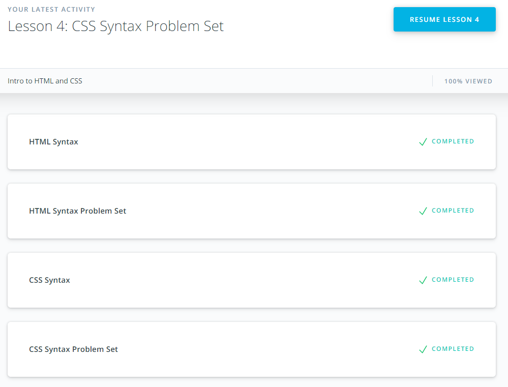
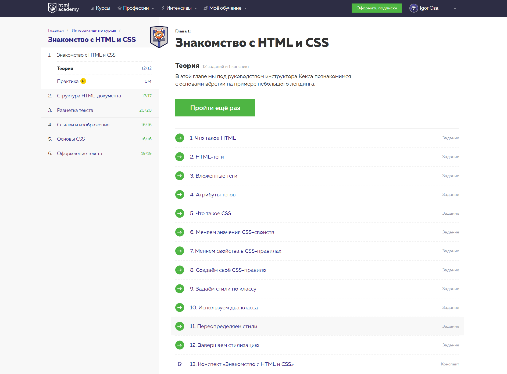
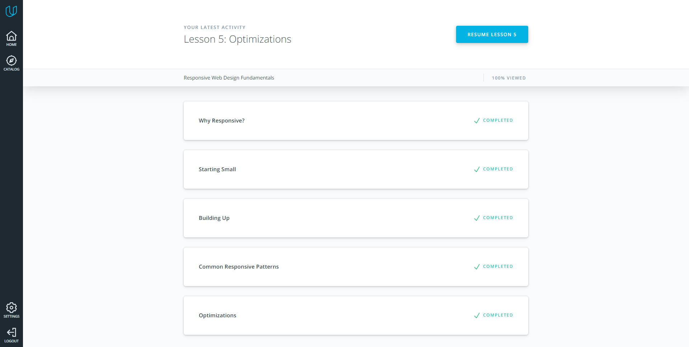
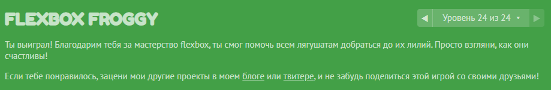

# Front-End Course

## Git and GitHub

I finished Version Control with Git course early, so it was a good refresh.

## Linux CLI, and HTTP

### Linux Survival (4 modules)

Improved understanding of how some shell commands works. Learned about pipe output.

### HTTP: The Protocol Every Web Developer Must Know - Part 1

TODO

### HTTP: The Protocol Every Web Developer Must Know - Part 2

TODO

## Git Collaboration

### What is Version Control

Done in [paragraph 1](#1-git-and-github)

### GitHub & Collaboration

Something new I found in using git fetch, contributing to other projects and how to stay sync with remote repo working with a forked local one. More deeply understanding of git rebase command.

## Intro to HTML and CSS

Simple refresh of well known things.

Some tasks were interesting and it was great to recall some info. In addition to this, now I have a Portfolio Website as a course project.

## Responsive Web Design

### 1. Responsive Web Design Fundamentals

Great course about Responsive Design with a lot of new information for me. Learned about what things make a website responsive, what is breakpoints, how control screen width and switch between layouts. Also I got better understand how flexbox works. Responsive Patterns are totally new to me. I saw it on sites but never knows how it's done.

A fun journey through Flexbox features. I learned a lot because I have not used it in my work before. Now I will.

## HTML & CSS practice: Hooli-style Popup

[Demo](http://igorosa.github.io/kottans-frontend/html-css-popup/index.html) |
[Code base](https://github.com/IgorOsa/frontend-2019-p2p/tree/html-css-popup/submissions/IgorOsa/html-css-popup)
