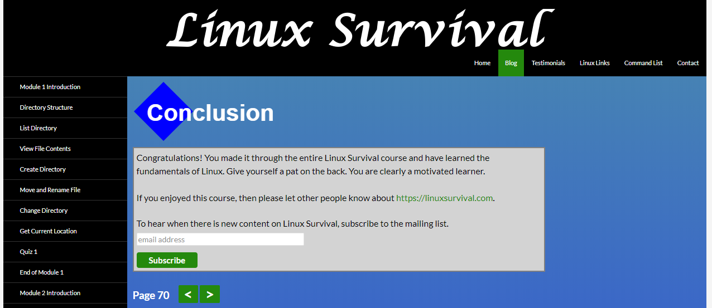
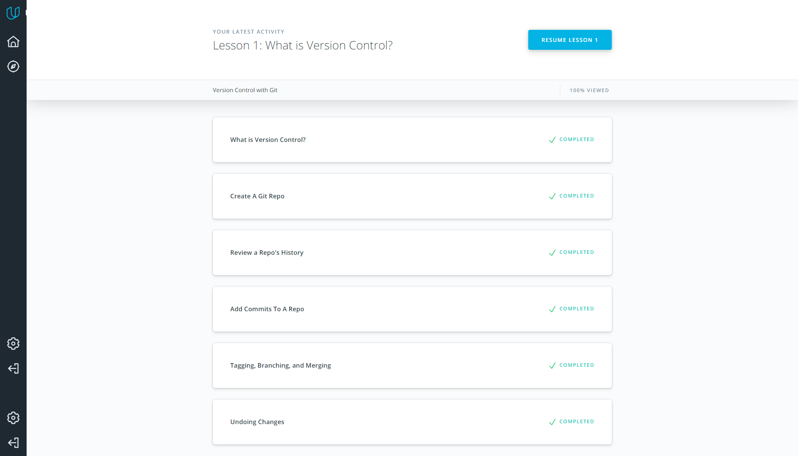
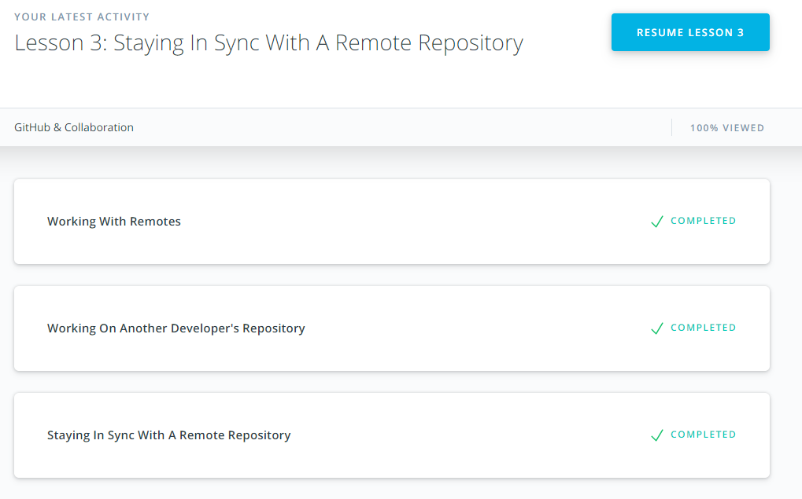

# Front-End Course

## Git and GitHub

I finished Version Control with Git course early, so it was a good refresh.

## Linux CLI, and HTTP

### Linux Survival (4 modules)

Improved understanding of how some shell commands works. Learned about pipe output.

### HTTP: The Protocol Every Web Developer Must Know - Part 1

TODO

### HTTP: The Protocol Every Web Developer Must Know - Part 2

TODO

## Git Collaboration

### What is Version Control

Done in [paragraph 1](#1-git-and-github)

### GitHub & Collaboration

Something new I found in using git fetch, contributing to other projects and how to stay sync with remote repo working with a forked local one. More deeply understanding of git rebase command.
